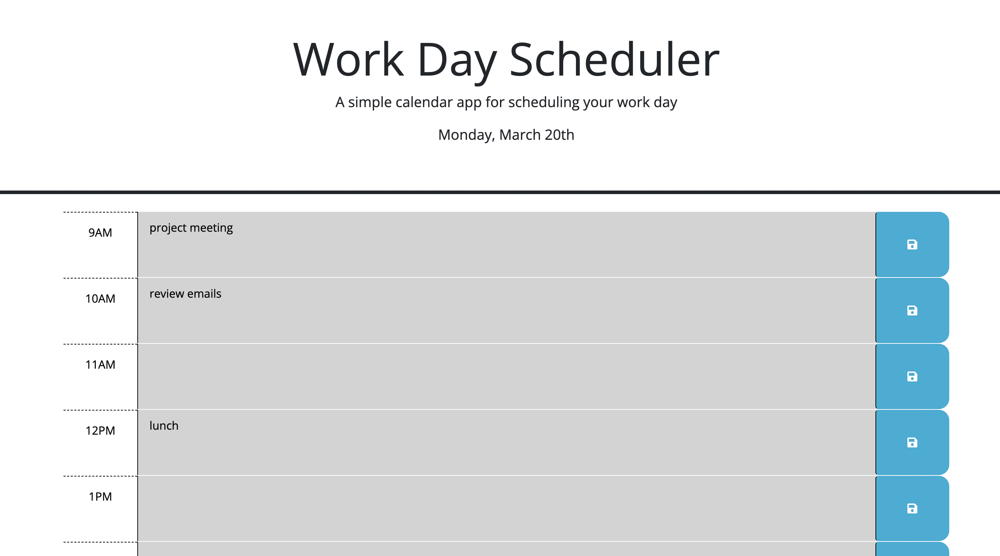
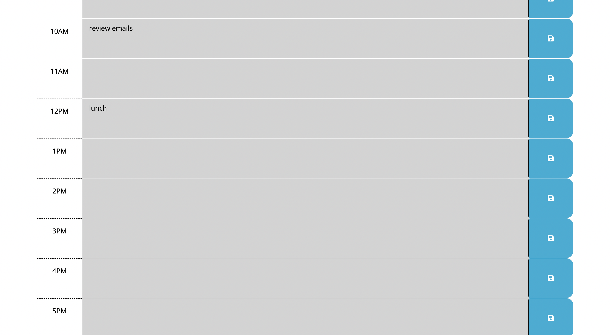

# task-calendar

## Description

This webpage is a digital hourly calendar where the user can input tasks for any hour of the day and the response will be stored. This calendar works only fo the present day. Many people, especially in the "9-5" work environment have many tasks to do and writting them down digitally is a more organized way than writing them down physically in post-it notes for example. This provides a cleaner, more straightfoward approach to writign down your tasks. It provides the hours of 9AM-5PM because these are the regular business hours. The task calendar is also color coded to help the user know if inputs are in the past, present, or future. Provide a short description explaining the what, why, and how of your project. Essentially, this solves the problem of knowing what a user has to do and when. With this, I learned the importance of dayJS and using Javascript to append elements. 

## Table of Contents

- [Installation](#installation)
- [Usage](#usage)
- [Credits](#credits)
- [License](#license)

## Installation

N/A

## Usage

To gain acess to this webpage, navigate to the URL and click on it. Once on the webpage, the header will let the user will se the day and day of the week dispayed at the top. To input tasks or events for the day, a user can simply click on any textbox that is gray, red, or green and start writing. Once the user is finished writing their task, then can click on the adjacent save button to the right of the textbox that is in a blue square. If the user refreshes, the input will still be there. Gray textboxes mean that that hour for the day has already passed. Red means that that is the present hour and green means future. 

## Credits

N/A

## License

Please refer to Github repository.